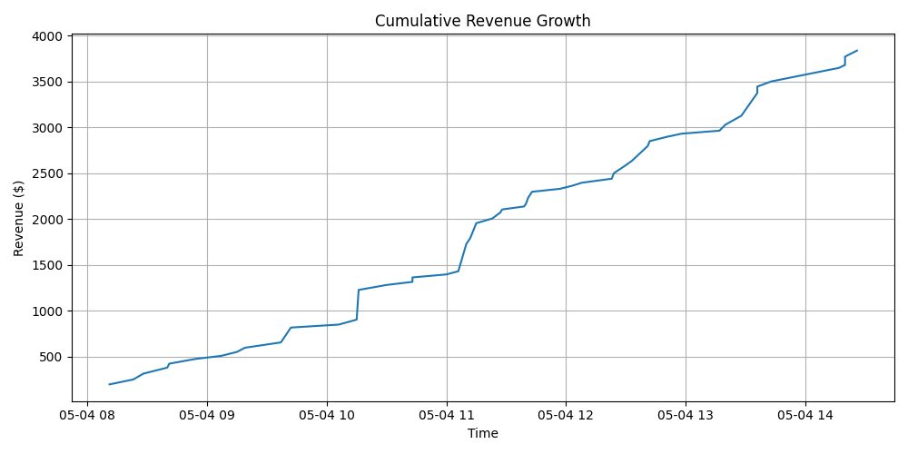
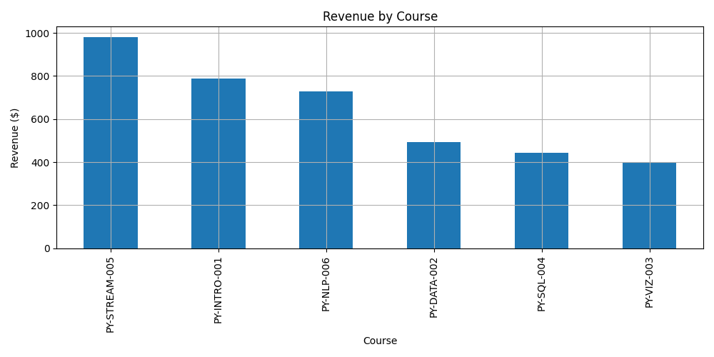
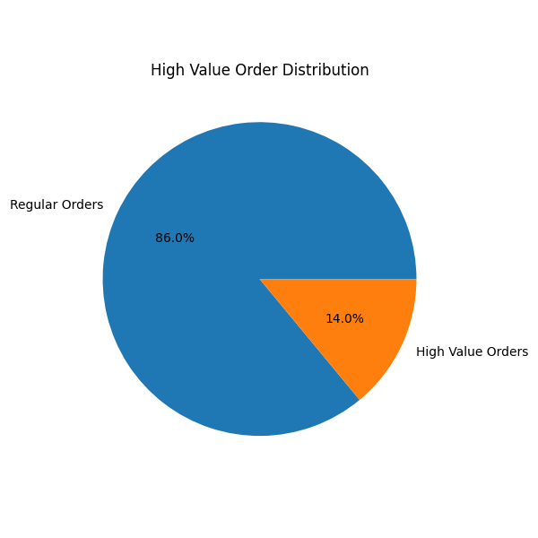

# streaming-03-analytics

[](https://denisecase.github.io/datafun-streaming/api/)
[](https://sabrouch36.github.io/streaming-03-analytics/)
[](./pyproject.toml)
[](./LICENSE)

> Streaming data analytics: validate and summarize messages.

Streaming analytics requires working with data in motion
and distributed, scalable systems.
This course builds capabilities through working projects.
In the age of generative AI, durable skills are grounded in real work:
setting up a professional environment,
reading and running code,
understanding the logic,
and pushing work to a shared repository.
Each project follows the structure of professional Python projects.
We learn by doing.

## This Project

This project focuses on analytics performed as messages are consumed.

The project uses Kafka to move sales messages from a producer to a consumer.
The consumer reads each message, validates required fields, computes derived values,
writes processed records to CSV, and logs running summary statistics.

This module adds validation and message-by-message analytics to the streaming workflow.

The goal is to see how each incoming message can be checked, transformed,
and summarized without waiting for a batch process.

## Working Files

You'll work with just these areas:

- **data/** - input data and generated output files
- **docs/** - the project narrative and documentation
- **src/streaming/** - producer, consumer, and supporting code
- **pyproject.toml** - update authorship & links
- **zensical.toml** - update authorship & links

## Instructions

Follow the
[](https://sabrouch36.github.io/streaming-03-analytics/)
to complete:

1. Phase 1. **Start & Run**
2. Phase 2. **Change Authorship**
3. Phase 3. **Read & Understand**
4. Phase 4. **Modify**
5. Phase 5. **Apply**

## Challenges

Challenges are expected.
Sometimes instructions may not quite match your operating system.
When issues occur, share screenshots, error messages, and details about what you tried.
Working through issues is part of implementing professional projects.

## Success

After completing Phase 1. **Start & Run**, you'll have your own GitHub project
running with Kafka.

Use four named terminals:

1. **kafka** - keep the Kafka message broker running
2. **topics** - create, list, or reset Kafka topics
3. **producer** - run the project and producer
4. **consumer** - run the consumer

After the producer and consumer run successfully, you should see:

```shell
========================
Consumer executed successfully!
========================
```

A new file `project.log` will appear in the root project folder
and processed data will appear in data/output/.

## Command Reference

The commands below are used in the workflow guide above.
They are provided here for convenience.

**Important:** the first few times you run a project,
follow the guide with the **complete instructions**.

<details>
<summary>Show command reference</summary>

### In a machine terminal (open in your `Repos` folder)

After you get a copy of this repo in your own GitHub account,
open a machine terminal in your `Repos` folder:

```bash
# Replace username with YOUR GitHub username.
git clone https://sabrouch36.github.io/streaming-03-analytics/

cd streaming-03-analytics
code .
```

### In VS Code Terminal 1: Start Kafka (kafka)

For full instructions see
[**start kafka**](https://denisecase.github.io/pro-analytics-02/kafka/start-kafka/).

If any command fails,
repeat the steps at
[**install kafka**](https://denisecase.github.io/pro-analytics-02/kafka/install-kafka/)
until starting up is reliable.

Open a new VS Code terminal. Rename it `kafka`.
If running Windows, specify the terminal type as **wsl** or
type `wsl`.
Run the commands one at a time.

Step 1. Verify Java and PATH

```bash
echo "$JAVA_HOME"

"$JAVA_HOME/bin/java" --version
```

Step 2. Rebuild ClusterID (as needed)

```bash
cd ~/kafka

rm -rf /tmp/kraft-combined-logs

KAFKA_CLUSTER_ID="$(bin/kafka-storage.sh random-uuid)"

echo "Cluster ID: $KAFKA_CLUSTER_ID"

bin/kafka-storage.sh format --standalone -t "$KAFKA_CLUSTER_ID" -c config/server.properties
```

Step 3. Start kafka server (keep running)

```bash
cd ~/kafka

bin/kafka-server-start.sh config/server.properties
```

### In VS Code terminal 2: Create Topic (topics)

For full instructions see
[**create topic**](https://denisecase.github.io/pro-analytics-02/kafka/create-topic/).

The topic name must match the name defined in your
`.env` file (copy `.env.example` to `.env`).

Open another VS Code terminal. Rename it `topics`.
If running Windows, specify the terminal type as **wsl** or
type `wsl`.
Run the commands one at a time.

```bash
cd ~/kafka

bin/kafka-topics.sh --create \
  --bootstrap-server localhost:9092 \
  --partitions 1 \
  --replication-factor 1 \
  --topic streaming-03-analytics-case
```

### In VS Code Terminal 3: Run Project and Producer (producer)

Open another VS Code terminal. Rename it `producer`.
If running Windows, use **PowerShell**.
Run the commands one at a time.

```shell
# reset uv cache only if/when you start getting strange dependency errors
# uv cache clean

uv self update
uv python pin 3.14
uv sync --extra dev --extra docs --upgrade

uvx pre-commit install

git add -A
uvx pre-commit run --all-files
# repeat if changes were made
git add -A
uvx pre-commit run --all-files

# run the producer
clear
uv run python -m streaming.kafka_producer_case

# do chores
uv run ruff format .
uv run ruff check . --fix
uv run python -m pyright
uv run python -m pytest
uv run python -m zensical build

# save progress
git add -A
git commit -m "update"
git push -u origin main
```

### In VS Code Terminal 4: Run Consumer (consumer)

Open another VS Code terminal. Rename it `consumer`.
If running Windows, use **PowerShell**.
Run the commands one at a time.
Clear the terminal, then start the consumer.

```shell
clear
uv run python -m streaming.kafka_consumer_case
```

To start fresh, see
[manage topics](https://denisecase.github.io/pro-analytics-02/kafka/manage-topics/)
to delete the topic and recreate it.

</details>

## Notes

- Use the **UP ARROW** and **DOWN ARROW** in the terminal to scroll through past commands.
- Use `CTRL+f` to find (and replace) text within a file.
- You do not need to add to or modify `tests/`. They are provided for example only.
- Many files are silent helpers. Explore as you like, but nothing is required.
- You do NOT not to understand everything; understanding builds naturally over time.

## Troubleshooting >>> or

If you see something like this in your terminal: `>>>` or `...`
You accidentally started Python interactive mode.
It happens.
Press `Ctrl+c` (both keys together) or `Ctrl+Z` then `Enter` on Windows.

## Technical Modification

For Phase 4, I implemented a custom streaming analytics enhancement by adding a new derived
business field called `high_value_order`.

### What I Changed

I created custom project files instead of modifying the original example files directly:

- `derived_fields_sabri.py`
- `data_contract_sabri.py`
- `kafka_consumer_sabri.py`

The new logic calculates whether an order should be classified as a high-value transaction
based on the final order total.

### Business Logic Added

A new threshold constant was introduced:

```python
HIGH_VALUE_ORDER_THRESHOLD = 150.0
```

If an order total is greater than or equal to this threshold, the consumer marks the transaction as:

```python
high_value_order = True
```

Otherwise:

```python
high_value_order = False
```

### Why I Made This Change

This modification simulates a real-world streaming analytics scenario where businesses
monitor high-value transactions in real time.

The enhancement demonstrates:

- streaming data enrichment
- custom business logic
- derived field calculations
- real-time transaction monitoring

### Results Observed

After running the modified consumer pipeline:

- the new `high_value_order` field appeared in the output CSV
- orders above the threshold were automatically flagged
- the streaming pipeline continued working successfully without errors

This modification improved the business intelligence capabilities of the project while
preserving the original example files.

## Phase 5 – Applied Streaming Revenue Analytics

For Phase 5, I extended the project beyond simple message enrichment and applied streaming
 analytics techniques to generate business insights from the processed sales data.

### Revenue Analytics Dashboard

A new analytics module (`revenue_dashboard.py`) was created to analyze the consumer output
 file and produce visual business intelligence reports.

### Additional Analytics Implemented

#### 1. Cumulative Revenue Growth

The project calculates cumulative revenue over time and generates a visualization showing
how revenue grows as new transactions are processed.

Output:

- `data/output/revenue_growth.png`

#### 2. Revenue by Course

The project aggregates revenue by product and identifies the highest-performing courses.

Output:

- `data/output/course_revenue.png`

Key Finding:

- `PY-STREAM-005` generated the highest revenue in the sample dataset.

#### 3. High-Value Order Distribution

Using the custom `high_value_order` field introduced in Phase 4, the project analyzes the
 proportion of high-value transactions versus regular transactions.

Output:

- `data/output/high_value_distribution.png`

Key Findings:

- Total Orders Processed: 50
- High Value Orders: 7
- High Value Percentage: 14.0%

### Business Insights

The analytics revealed:

- Revenue growth increased steadily throughout the streaming session.
- A small percentage of transactions generated disproportionately high value.
- Streaming Data with Python (`PY-STREAM-005`) was the strongest revenue-generating product.
- Real-time enrichment combined with post-stream analytics provides actionable business intelligence.

### Visualizations

#### Revenue Growth



#### Revenue by Course



#### High Value Order Distribution



### Skills Demonstrated

- Kafka Streaming Analytics
- Data Validation
- Derived Field Engineering
- Business KPI Analysis
- Revenue Analytics
- Data Visualization with Matplotlib
- Streaming Data Enrichment
- Real-Time Business Intelligence
